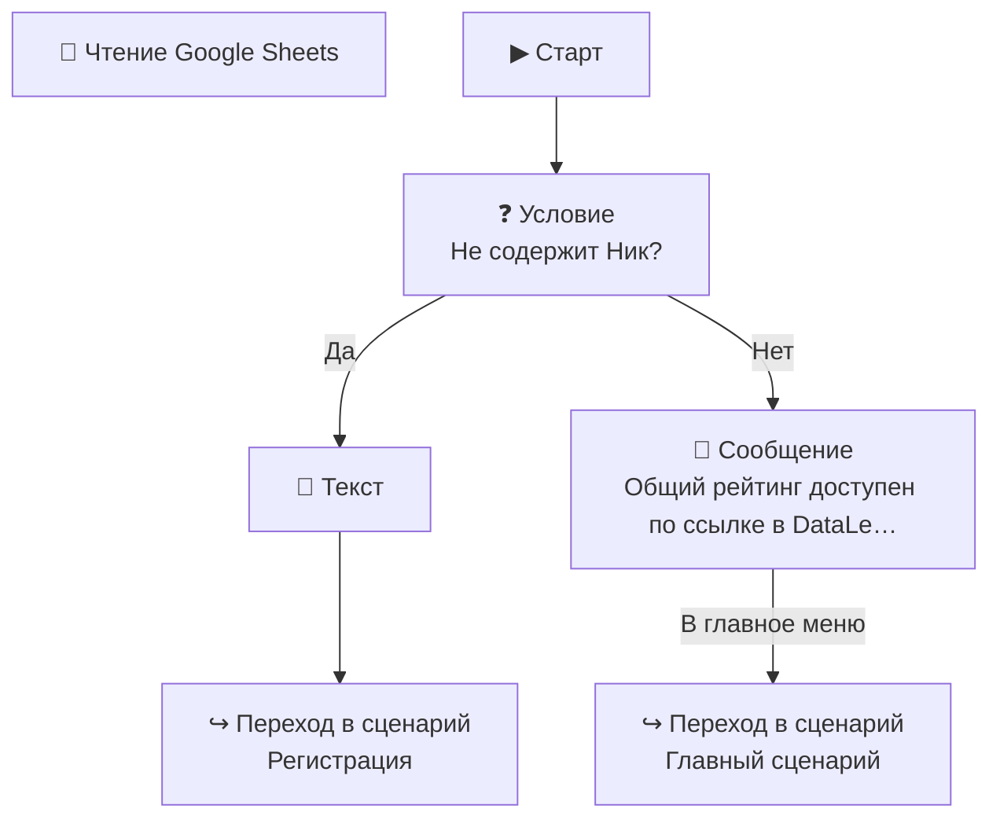

# Рейтинг

Рейтинг игроков из Google Sheets и дашборд в DataLens.

## Схема

```mermaid
flowchart TD
  s1["💬 Текст"]
  s2["↪ Переход в сценарий<br/>Регистрация"]
  s3["❓ Условие<br/>Не содержит Ник?"]
  s4["📗 Чтение Google Sheets"]
  s5["↪ Переход в сценарий<br/>Главный сценарий"]
  s6["▶ Старт"]
  s7["💬 Сообщение<br/>Общий рейтинг доступен по ссылке в DataLe…"]
  s1 --> s2
  s3 -- "Да" --> s1
  s3 -- "Нет" --> s7
  s6 --> s3
  s7 -- "В главное меню" --> s5
```

Полная выгрузка блоков — в соседнем `.json` (секреты заменены плейсхолдерами).
